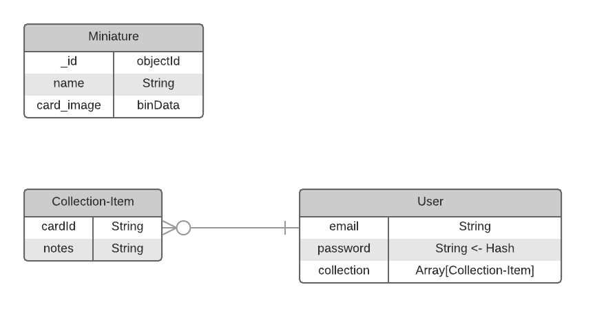

# Project 2 Proposal: Star Wars Miniatures App

## Concept

Me and my friends have been into collecting and playing Star Wars Miniatures.

I usually use [rebelscum.com](rebelscum.com) as a resource to look up cards I don't have, but it is inconvenient to keep track of which miniatures I own in my own collection.

So, I am interested in building an app to list out Miniatures, and when a User logs in, they can see their own collection and make notes on individual miniatures they own.

### ERD

There isn't a direct relationship between the Miniature model and the Collection-Item. I am using the _id of the Miniature model as a reference stored in Collection-Item, so that I'm not duplicating the data in Miniature unnecessarily, but it would be acurate to say that one Miniature belongs to zero to many Collection-Items

### CRUD functionality

- [ ] READ Miniatures

- [ ] CREATE User

- [ ] CREATE new Collection-Item for User

- [ ] READ all Collection-Items for User

- [ ] UPDATE Collection-Item notes field

- [ ] DELETE Collection-Item

- [ ] UPDATE User email field, password field

- [ ] UPDATE User collection field (add new collection-items)

- [ ] DELETE User

This is what I'm aiming for for the MVP. I think it would be good to add an "admin-level" field to the Users model, and make a view where an admin can create and delete Miniatures, but to start I'm going to seed that collection manually.

### Implementation

I want to make something similar to book-e-backend and the Gaphy express-api-lab in that I want to make my backend send JSON, for some other front end application to read from.

I have to think a little bit about how this will affect authentication. I will likely come to office hours the morning of Monday to talk about this implemenatation further, but it would be great if you could give me any feedback about it.

### Considerations

 I already have permission to use the image assets for the Miniatures from rebelscum.com as per their [image use policy](http://www.rebelscum.com/use.asp)

---

A challenge I know I have to address is how I plan to store the images themselves.

The simplest way would be to store the images directly in an `assets/images` directory and store the references to the images as a String in the field, which is perfectly fine. I might just do that for the MVP.

But I am interested in seeing if I can store the images directly in the mongo database itself.

I should be able to do this with the Binary Data field type, as long as my total Document is less than 16MB (which might not be possible).

There is also something called [GridFS](https://docs.mongodb.com/manual/core/gridfs/) that can allow me to work with files that exceed the 16MB limit.

I also have to think about how this will work with JSON. I found a [resource](https://stackoverflow.com/a/34485762) on Stack Overflow about it, but I don't know from reading it if this will be an issue or not.

---

I am also interested in using Vue instead of Handlebars, but would like to ask if that is ok first.
